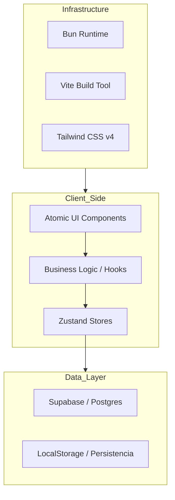
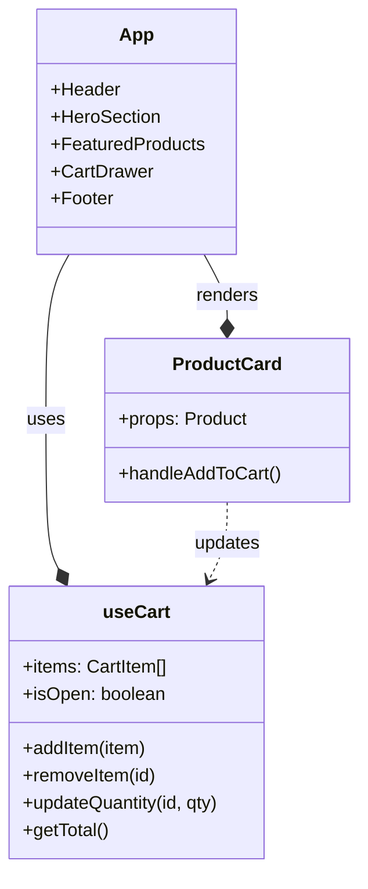

# 🏛️ Arquitectura del Sistema - RYŪKAMI

Este documento detalla la estructura técnica, los patrones de diseño y el flujo de datos de la plataforma RYŪKAMI.

---

## 🏗️ Estructura del Proyecto

El proyecto sigue un patrón de **Monolito Modular** organizado por dominios de negocio para facilitar la escalabilidad y el mantenimiento.

### Organización de Directorios

- `src/components/ui/`: Componentes básicos reutilizables (botones, inputs).
- `src/components/[feature]/`: Componentes específicos de una funcionalidad (ej. `products`, `cart`).
- `src/store/`: Estado global de la aplicación gestionado por Zustand.
- `src/lib/`: Configuraciones de utilidades y clientes (ej. cliente de Supabase).
- `src/types/`: Definiciones de TypeScript y validaciones de Zod.

---

## 🔄 Flujo de Datos

### 1. Gestión del Carrito (Zustand)

El flujo del carrito es reactivo y persistente:

1. **Acción**: El usuario hace clic en "AÑADIR" en `ProductCard.tsx`.
2. **Tienda**: Se invoca `addItem` desde `useCart` (Zustand).
3. **Lógica**: La tienda verifica si el producto ya existe (por ID + talla + color).
4. **Estado**: Se actualiza el array de `items` y el estado `isOpen` del drawer.
5. **UI**: `CartDrawer.tsx` y el contador del `Header.tsx` se renderizan automáticamente.

### 2. Sincronización con Backend (Supabase)

(Próximamente en Fase 2)

1. **Auth**: El usuario se autentica vía Supabase Auth.
2. **DB**: Las órdenes y el inventario se gestionan en PostgreSQL.
3. **Realtime**: Actualizaciones de stock en tiempo real mediante suscripciones de Supabase.

---

## 🎨 Arquitectura de Estilos y Animaciones

### Design Tokens

Utilizamos variables CSS personalizadas dentro del ecosistema de Tailwind v4 para mantener la consistencia de la marca (Spirit Fire Redwood, Dragon Black Obsidian).

### Patrón de Interacción

- **Micro-interacciones**: Todo elemento `clickable` usa un patrón de escalado (Motion) definido en `.agent/skills/ryukami-standards/SKILL.md`.
- **Efectos Glare/Glow**: Implementados mediante gradientes dinámicos y sombras animadas de Framer Motion.

---

## 📊 Diagrama de Componentes Clave

---

## 🛡️ Seguridad y Calidad

- **Validación**: Toda entrada de datos externa se sanitiza mediante esquemas de **Zod**.
- **Tipado**: TypeScript en modo estricto garantiza la integridad de los datos en toda la aplicación.
- **Runtime**: **Bun** se utiliza para garantizar builds rápidos y un entorno de ejecución eficiente.
