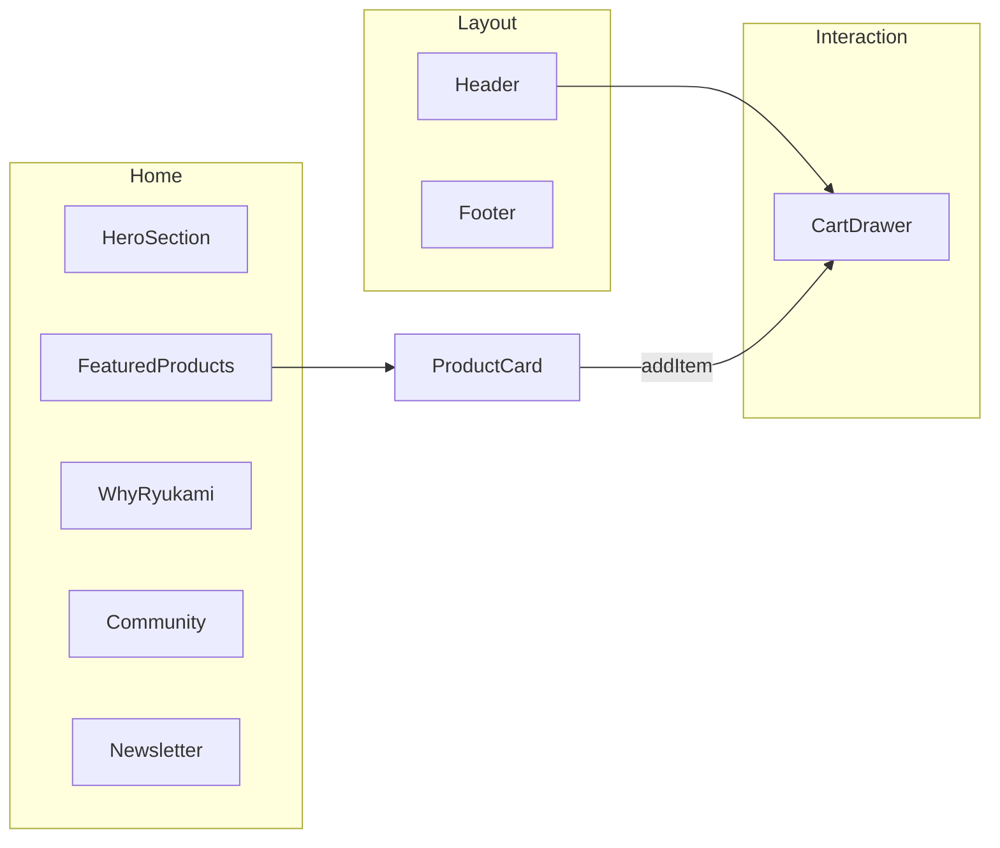

# 📁 Estructura y Flujos - RYŪKAMI

Este documento proporciona una visión detallada de los diagramas y flujos operativos del proyecto.

---

## 🗺️ Mapa de Componentes



---

## ⚡ Flujo de Datos del Carrito

1. **Usuario** selecciona producto.
2. **ProductCard** dispara `addItem`.
3. **Zustand Store (`useCart`)**:
   - Genera ID único: `id-size-color`.
   - Verifica duplicados.
   - Incrementa cantidad o añade nuevo registro.
4. **LocalStorage**: (Pendiente implementar persistencia automática).
5. **Vista** se actualiza:
   - `Header` muestra burbuja roja con cantidad.
   - `CartDrawer` se llena con los items.

---

## 🎨 Token Colors (Visual Guide)

| Token          | Hex       | Uso                                 |
| :------------- | :-------- | :---------------------------------- |
| `dragon-black` | `#0A0A0B` | Fondos, superficies profundas       |
| `dragon-fire`  | `#DC2626` | Botones primary, acentos críticos   |
| `dragon-gold`  | `#F59E0B` | Detalles de lujo, bordes especiales |
| `dragon-cyan`  | `#06B6D4` | Highlights, badges técnicos         |
| `dragon-white` | `#FAFAFA` | Texto, iconos destacados            |

---

## 🛠️ Comando de Verificación de Arquitectura

Para asegurar que la arquitectura de carpetas se mantiene según el estándar:

```bash
# Verificar integridad de tipos y estructura
bun run typecheck
```
