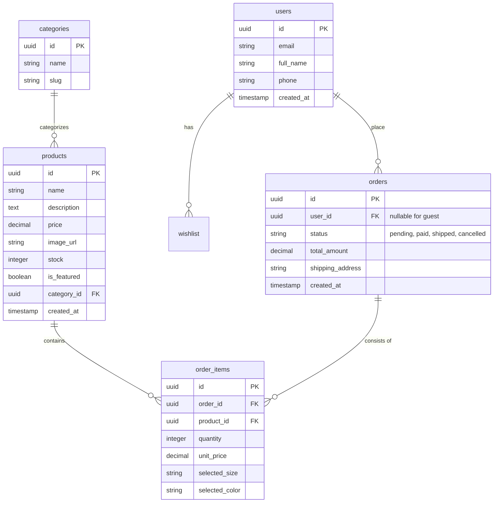

# 🗄️ Diseño de Base de Datos - RYŪKAMI

Este documento detalla el esquema relacional, modelos y tipos de datos para la persistencia en **Supabase (PostgreSQL)**.

---

## 🗺️ Diagrama Entidad-Relación (ERD)



---

## 📋 Definición de Tablas

### 1. `products`

Almacena el catálogo principal de streetwear.

- `id`: UUID (Primary Key).
- `name`: VARCHAR(255) - Nombre comercial.
- `price`: DECIMAL(10, 2) - Precio en Soles (S/.).
- `stock`: INTEGER - Cantidad disponible.
- `category_id`: UUID (Foreign Key a `categories`).

### 2. `categories`

Organización de la tienda.

- `id`: UUID (PK).
- `name`: VARCHAR(50) (ej. "Polos", "Urban Shorts").
- `slug`: VARCHAR(50) - Para URLs amigables.

### 3. `orders` & `order_items`

Gestión de ventas y detalle de productos comprados.

- **Relación**: Una orden tiene muchos items. Se captura el `unit_price` en el momento de la compra para historial de precios.

---

## 🛡️ Modelos Recomendados (Zustand & TypeScript)

Recomiendo centralizar estos tipos en `src/types/database.ts` para que coincidan con la DB:

```typescript
// Modelo de Producto
export interface Product {
  id: string;
  name: string;
  price: number;
  image_url: string;
  category_id: string;
  is_featured: boolean;
  stock: number;
}

// Modelo de Item en Carrito (basado en DB)
export interface CartItem extends Pick<
  Product,
  "id" | "name" | "price" | "image_url"
> {
  quantity: number;
  size: "S" | "M" | "L" | "XL";
  color: string;
}
```

---

## 🔒 Políticas de Seguridad (RLS - Row Level Security)

Al usar Supabase, debemos configurar estas reglas:

- **`products`**: `SELECT` público (cualquiera puede ver), `INSERT/UPDATE` solo para administradores.
- **`orders`**: `INSERT` para usuarios autenticados o invitados con validación, `SELECT` solo para el dueño de la orden (`auth.uid() == user_id`).
- **`wishlist`**: `ALL` solo para el dueño del perfil.

---

## 🚀 Recomendaciones de Optimización

1. **Índices**: Crear índice en `products.category_id` y `orders.user_id` para búsquedas rápidas.
2. **PostGIS**: Si planeas envíos por GPS en el futuro, PostgreSQL soporta extensiones geográficas.
3. **Persistencia de Carrito**: Usar el middleware `persist` de Zustand para sincronizar automáticamente con `localStorage`.
